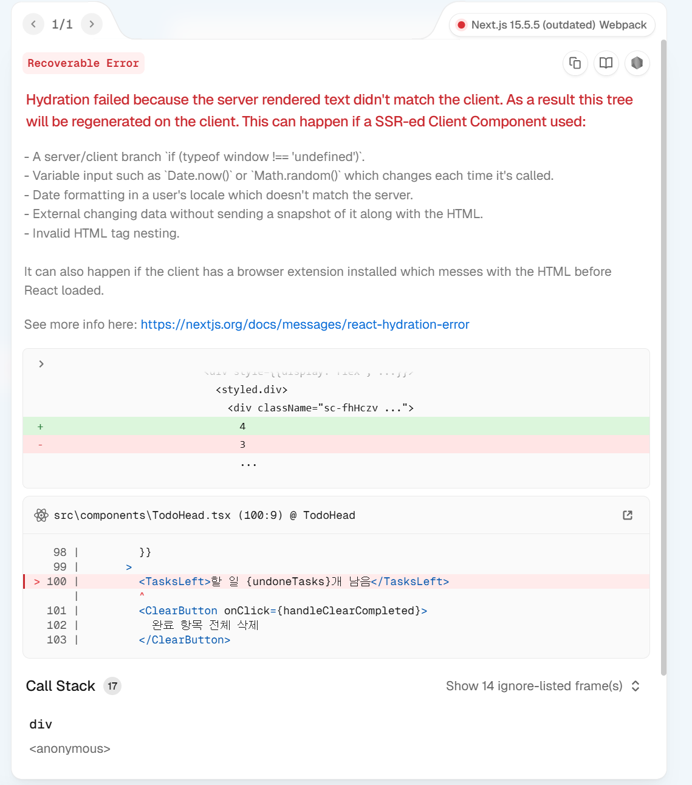

## 기존 React 버전과 Next.js 버전의 차이점 및 수정 과정

### 기본 구조 차이

| 구분                   | React                                                        | Next.js                                                    |
| ---------------------- | ------------------------------------------------------------ | ---------------------------------------------------------- |
| **렌더링 방식**        | 브라우저에서만 렌더링 (CSR)                                  | 기본적으로 서버에서 렌더링 (SSR)                           |
| **라우팅**             | `react-router-dom` 설정 필요                                 | `app/` 폴더 구조만으로 자동 라우팅                         |
| **환경 차이**          | 항상 브라우저 환경 (`window`, `localStorage` 바로 사용 가능) | 서버에서도 실행되므로 브라우저 전용 객체 사용 시 주의 필요 |
| **SEO**                | 초기 HTML이 비어 있어서 불리                                 | SSR로 초기 HTML이 완성되어 SEO에 유리                      |
| **이미지/폰트 최적화** | 수동 설정 필요                                               | `next/image`, `next/font`로 자동 최적화                    |
| **배포**               | 정적 빌드 후 업로드                                          | SSR/SSG 모두 가능, Vercel 등과 연동 쉬움                   |

---

### 위 차이점으로 인해 Next.js로 마이그레이션하면서 생긴 주요 문제 & 해결 방법

#### 1. `localStorage is not defined`


- **원인:** Next.js는 서버에서도 렌더링을 하기 때문에,  
  서버 환경에는 localStorage나 window 객체가 없음.
- **해결:**
  ```tsx
  if (typeof window === "undefined") return TODO_LIST;
  ```
  처럼 가드문을 추가해서 서버에서는 접근하지 않도록 수정.
  또한 데이터 저장은 useEffect 안에서만 실행하도록 변경.

#### 2. 하이드레이션 오류(Hydration failed...)



- **원인:** 서버에서 렌더된 초기 HTML과 클라이언트 렌더 결과가
  달라서 발생 -> ex. 서버는 할 일 3개 남음, 클라이언트는 localStorage에서 불러온 할 일 4개 남음으로 다를 때 생김

- **해결:**
  useState의 초기값을 항상 일정하게 TODO_LIST로 주고, 마운트 후(useEffect)에만 localStorage 데이터를 불러오도록 변경함

  ```tsx
  const [todos, setTodos] = useState<Todo[]>(TODO_LIST);

  useEffect(() => {
    const saved = window.localStorage.getItem(LOCAL_STORAGE_KEY);
    if (saved) setTodos(JSON.parse(saved));
  }, []);
  ```

#### 3. 스타일 깨짐


- **원인:** 기존에는 전체가 CSR이라 중앙 정렬이 맞았지만,
  Next.js 구조에서는 TodoTemplate만 가운데 정렬되고
  버튼은 바깥에 있어서 왼쪽에 붙음.
- **해결:**
  버튼을 정렬하기 위해 TodoTemplate과 GotoDiary 버튼을 감싸서 column으로 정렬하는 래퍼 추가
